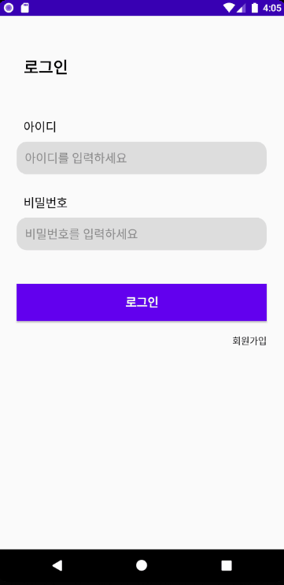
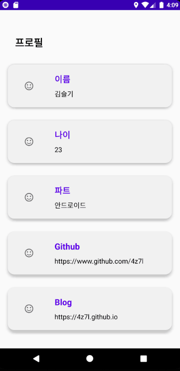

# ON SOPT 27th Android Assignment

- __1주차__
	+ [필수 과제]()
	+ [성장 과제1]()
	+ [성장 과제2]()
- __2주차__
	+ [필수 과제]()
	+ [성장 과제1]()
	+ [성장 과제2]()


# 1주차 과제


|  필수 과제, 성장 과제1  |        성장 과제2         |
| :---------------------: | :-----------------------: |
|  |  |


<br>


## 필수 과제

- 회원가입 조건을 모두 입력했을 시에만 회원가입 완료


<br>

> #### 주요 코드


__SignUpActivity.kt__
- 회원가입 버튼 클릭 시 세 개의 Edittext가 채워져있는지 확인
```kotlin
btn_register.setOnClickListener {  
  if(et_id.text.isNotEmpty() && et_name.text.isNotEmpty() && et_password.text.isNotEmpty() ) {  
        //회원가입 완료
    }  
    else {  
        //회원가입 실패
    }  
}
```


<br>

## 성장과제 1

- 회원가입 완료 후 로그인 화면에 정보 자동 완성


<br>

> #### 주요 코드


__SignInActivity.kt__
- 회원가입 버튼 클릭시 `startActivityForResult`로 __SignUpActivity__ 실행

```kotlin
override fun onActivityResult(requestCode: Int, resultCode: Int, data: Intent?) {  
    super.onActivityResult(requestCode, resultCode, data)  
  
    if(requestCode==SIGN_UP_REQUEST_CODE){  
        if(resultCode== RESULT_OK){  
            et_id.setText(data?.getStringExtra("id"))  
            et_password.setText(data?.getStringExtra("password"))  
        }  
    }  
}  
  
fun initView() {  
    btn_register.setOnClickListener {  
		startSignUpActivity()  
    }
}  
  
fun startSignUpActivity() {  
    startActivityForResult(Intent(this, SignUpActivity::class.java), SIGN_UP_REQUEST_CODE);  
}
```

<br>

__SignUpActivity.kt__

- 회원가입 완료 시 `Intent`로 값 전달

```kotlin
val intent = Intent().apply {  
	putExtra("id",et_id.text.toString())  
	putExtra("password",et_password.text.toString())  
}
```


<br>

## 성장 과제 2

- 자동 로그인


<br>

> #### 주요 코드


__PreferenceUtil.kt__

- SharedPreference 저장

<br>

__SignInActivity.kt__

```kotlin
//로그인 버튼 클릭 시 SharedPreference 저장
btn_login.setOnClickListener {
            if(et_id.text.isNotEmpty() && et_password.text.isNotEmpty()){
                ...

                SoptApplication.preferences.setBoolean("auto_login",true)
                SoptApplication.preferences.setString("id",et_id.text.toString())
                SoptApplication.preferences.setString("password",et_password.text.toString())

                ...
            }
            else {
                ...
            }
        }
```

```kotlin
//Activity 시작 시 자동로그인이 설정되어 있느지 확인 -> 설정되어있다면 ProfileActivity 실행
override fun onStart() {
        super.onStart()

        if(SoptApplication.preferences.getBoolean("auto_login", false)){
            startProfileActivity()
        }
    }
```


<br>


# 2주차 과제


|        필수 과제        |        성장 과제1         |
| :---------------------: | :-----------------------: |
|  |  |


<br>

## 필수 과제

- RecyclerView 사용


<br>

> #### 주요 코드


1. Activity 에 RecyclerView 추가
2. item xml 추가
3. RecyclerView.Adapter 생성
4. RecyclerView에 Adapter 연결


__ProfileActivity.kt__

```kotlin
fun initView() {
    //initiate recyclerview
    recyclerView.apply {
            profileAdapter.itemViewType = 1
            layoutManager = LinearLayoutManager(this@ProfileActivity)
    		adapter = profileAdapter
	}
}
fun initView() {
    //setting click listener
    profileAdapter.onItemClickListener = {
        ...
    }
}
fun initData() {
    //adapt data
    profileList = mutableListOf(
        Profile("이름","김슬기", R.drawable.ic_smile, false),
        Profile("나이","23", R.drawable.ic_smile, false),
        Profile("파트","안드로이드", R.drawable.ic_smile, false),
        Profile("Github","https://www.github.com/4z7l", R.drawable.ic_smile, true),
        Profile("Blog","https://4z7l.github.io", R.drawable.ic_smile, true)
    )
    profileAdapter.data = profileList
    profileAdapter.notifyDataSetChanged()
}
```


__ProfileAdapter.kt__

```kotlin
class ProfileAdapter(private val context : Context) : RecyclerView.Adapter<ProfileAdapter.ViewHolder>() {

    val linearView = R.layout.item_profile
    val gridView = R.layout.item_profile_grid

    var itemViewType = linearView
        set(value) {
            field = if(value==1) linearView else gridView
        }

    var data = mutableListOf<Profile>()
        set(value) {
            field = value
        }

    var onItemClickListener : ((Profile) -> Unit) ?= null
        set(value) {
            field = value
        }


    inner class ViewHolder(itemView: View) : RecyclerView.ViewHolder(itemView) {
        private val title : TextView = itemView.title
        private val subtitle : TextView = itemView.subtitle
        private val image : ImageView = itemView.image

        fun onBind(data : Profile) {
            title.text = data.title
            subtitle.text = data.subtitle
            image.setImageResource(data.resourceId)

            itemView.setOnClickListener {
                onItemClickListener?.invoke(data)
            }

        }
    }

    override fun onCreateViewHolder(parent: ViewGroup, viewType: Int): ViewHolder {
        val view = LayoutInflater.from(context).inflate(itemViewType, parent, false)
        return ViewHolder(view)
    }

    override fun onBindViewHolder(holder: ViewHolder, position: Int) {
        holder.onBind(data[position])
    }

    override fun getItemCount(): Int = data.size
}
```


<br>


## 성장 과제 1

- GridLayout 사용


<br>

> #### 주요 코드


__ProfileActivity.kt__

```kotlin
fun initView() {
    //initiate recyclerview
    recyclerView.apply {
            profileAdapter.itemViewType = 2
            layoutManager = GridLayoutManager(this@ProfileActivity,2)
    		adapter = profileAdapter
	}
}
```


<br>

## 성장 과제 2

- RecyclerView Item이동 삭제 구현


<br>

> #### 주요 코드


