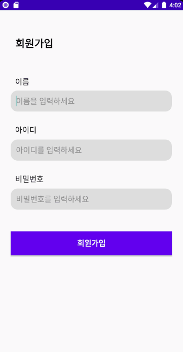
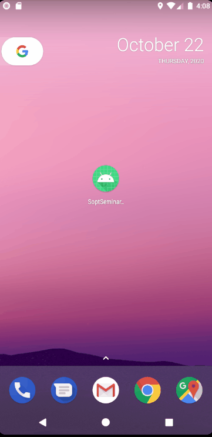
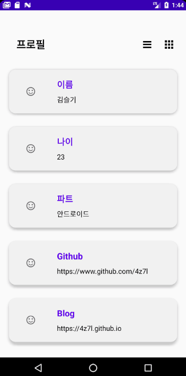
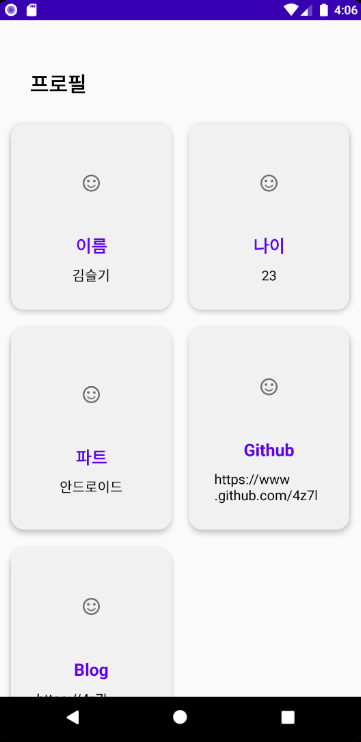

# ON SOPT 27th Android Assignment

 SOPT 27기 안드로이드 세미나 과제


### Spec

- Architecture : MVVM
- Dependency Injection : Koin
- Jetpack(ViewModel, Databinding, LiveData, Room)


### Third Party Library

- RxJava


# Index

- [__1주차__](https://github.com/ONSOPTFunAndroid/4z7l-ONSOPT27thAssignment#1%EC%A3%BC%EC%B0%A8-%EA%B3%BC%EC%A0%9C)
	+ [필수 과제](https://github.com/ONSOPTFunAndroid/4z7l-ONSOPT27thAssignment#%ED%95%84%EC%88%98-%EA%B3%BC%EC%A0%9C)
	+ [성장 과제1](https://github.com/ONSOPTFunAndroid/4z7l-ONSOPT27thAssignment#%EC%84%B1%EC%9E%A5%EA%B3%BC%EC%A0%9C-1)
	+ [성장 과제2](https://github.com/ONSOPTFunAndroid/4z7l-ONSOPT27thAssignment#%EC%84%B1%EC%9E%A5-%EA%B3%BC%EC%A0%9C-2)
- [__2주차__](https://github.com/ONSOPTFunAndroid/4z7l-ONSOPT27thAssignment#2%EC%A3%BC%EC%B0%A8-%EA%B3%BC%EC%A0%9C)
	+ [필수 과제](https://github.com/ONSOPTFunAndroid/4z7l-ONSOPT27thAssignment#%ED%95%84%EC%88%98-%EA%B3%BC%EC%A0%9C-1)
	+ [성장 과제1](https://github.com/ONSOPTFunAndroid/4z7l-ONSOPT27thAssignment#%EC%84%B1%EC%9E%A5-%EA%B3%BC%EC%A0%9C-1)
	+ [성장 과제2](https://github.com/ONSOPTFunAndroid/4z7l-ONSOPT27thAssignment#%EC%84%B1%EC%9E%A5-%EA%B3%BC%EC%A0%9C-2-1)
- [**3주차**]()


# 1주차 과제


|   필수 과제, 성장 과제1   |        성장 과제2         |
| :-----------------------: | :-----------------------: |
|  |  |


<br>


## 필수 과제

- 회원가입 조건을 모두 입력했을 시에만 회원가입 완료


<br>

> #### 주요 코드


__SignUpActivity.kt__


- 회원가입 버튼 클릭 시 세 개의 Edittext가 채워져있는지 확인
```kotlin
private fun signUp() {
        ...
        if(id.isNotEmpty() && name.isNotEmpty() && password.isNotEmpty() ) {
            //회원가입 완료
        }
        else {
            //회원가입 실패
        }
    }
```


<br>

## 성장과제 1

- 회원가입 완료 후 로그인 화면에 정보 자동 완성


<br>

> #### 주요 코드


__SignInActivity.kt__


- 회원가입 버튼 클릭시 `startActivityForResult`로 __SignUpActivity__ 실행

```kotlin
override fun onActivityResult(requestCode: Int, resultCode: Int, data: Intent?) {
    super.onActivityResult(requestCode, resultCode, data)

    if(requestCode==SIGN_UP_REQUEST_CODE){
        if(resultCode== RESULT_OK){
            viewDataBinding.etId.setText(data?.getStringExtra("id"))
            viewDataBinding.etPassword.setText(data?.getStringExtra("password"))
        }
    }
} 
  
fun initView() {  
    viewDataBinding.btnRegister.setOnClickListener {
            startSignUpActivity()
    }
}  
  
fun startSignUpActivity() {  
    startActivityForResult(Intent(this, SignUpActivity::class.java), SIGN_UP_REQUEST_CODE);  
}
```

<br>

__SignUpActivity.kt__


- 회원가입 완료 시 `Intent`로 값 전달

```kotlin
val intent = Intent().apply {  
	putExtra("id",et_id.text.toString())  
	putExtra("password",et_password.text.toString())  
}
```


<br>

## 성장 과제 2

- 자동 로그인


<br>

> #### 주요 코드


__PreferenceUtil.kt__

- SharedPreference 저장

<br>

__SignInActivity.kt__


```kotlin
//로그인 성공 시 SharedPreference 저장
private fun signIn() {
        ...
        if(id.isNotEmpty() && password.isNotEmpty()){
            ...
            SoptApplication.preferences.setBoolean("auto_login",true)
            SoptApplication.preferences.setString("id",id.toString())
            SoptApplication.preferences.setString("password",password.toString())

            startProfileActivity()
        }
        ...
    }
```

```kotlin
//Activity 시작 시 자동로그인이 설정되어 있느지 확인 -> 설정되어있다면 ProfileActivity 실행
override fun onStart() {
        super.onStart()

        if(SoptApplication.preferences.getBoolean("auto_login", false)){
            startProfileActivity()
        }
    }
```


<br>


# 2주차 과제


|  필수 과제, 성장 과제 1   |        성장 과제2         |
| :-----------------------: | :-----------------------: |
|  |  |


<br>

## 필수 과제

- RecyclerView 사용


1. Activity 에 RecyclerView 추가
2. item xml 추가
3. RecyclerView.Adapter 생성
4. RecyclerView에 Adapter 연결


<br>


## 성장 과제 1

- GridLayout 사용


1. GridLayout으로 바꿔주는 버튼 클릭 시 recyclerview의 adapter와 layoutmanager 다시 세팅


<br>

## 성장 과제 2

- RecyclerView Item이동 삭제 구현


1. `ItemTouchHelperListener` 생성
2. `ItemTouchHelperCallback` 생성
3. RecyclerView.Adapter에 `ItemTouchHelperListener`  구현 
4. `ItemTouchHelper`에 `ItemTouchHelperCallback` 등록


<br>

> #### 주요 코드


__ProfileActivity.kt__


```kotlin

private fun initView() {
    //item touch helper 등록
    val itemTouchHelperCallback = ItemTouchHelperCallback(profileAdapter)
    val itemTouchHelper = ItemTouchHelper(itemTouchHelperCallback)

    viewDataBinding.recyclerView.apply {
        layoutManager = linearLayoutManager
        adapter = profileAdapter
        setHasFixedSize(true)
    }

    itemTouchHelper.attachToRecyclerView(viewDataBinding.recyclerView)
}

private fun initEvent() {
    viewDataBinding.btnLinear.setOnClickListener {
        setRecyclerViewLinear()
    }
    viewDataBinding.btnGrid.setOnClickListener {
        setRecyclerViewGrid()
    }
}

private fun initData() {
    profileList = mutableListOf(...)
    profileAdapter.setData(profileList)
}
```


__ProfileAdapter.kt__


```kotlin
class ProfileAdapter(private val context : Context) : RecyclerView.Adapter<ProfileAdapter.ViewHolder>(), ItemTouchHelperListener {

    private val data = mutableListOf<Profile>()

    private val linearItemView = R.layout.item_profile
    private val gridItemView = R.layout.item_profile_grid

    private var itemViewType : Int = linearItemView

    private var onItemClickListener : ((Profile) -> Unit) ?= null

    fun setData(data : MutableList<Profile>) {
        this.data.clear()
        this.data.addAll(data)
        notifyDataSetChanged()
    }

    fun setOnItemClickListener(listener : (Profile) -> Unit) {
        this.onItemClickListener = listener
    }

    fun setGridItemViewType(){
        this.itemViewType = gridItemView
    }

    fun setLinearItemViewType(){
        this.itemViewType = linearItemView
    }

    inner class ViewHolder(itemView: View) : RecyclerView.ViewHolder(itemView) {
        private val title : TextView = itemView.findViewById(R.id.title)
        private val subtitle : TextView = itemView.findViewById(R.id.subtitle)
        private val image : ImageView = itemView.findViewById(R.id.image)

        fun onBind(data : Profile) {
            title.text = data.title
            subtitle.text = data.subtitle
            image.setImageResource(data.resourceId)

            itemView.setOnClickListener {
                onItemClickListener?.invoke(data)
            }
        }
    }

    override fun onCreateViewHolder(parent: ViewGroup, viewType: Int): ViewHolder {
        val view = LayoutInflater.from(context).inflate(itemViewType, parent, false)
        return ViewHolder(view)
    }

    override fun onBindViewHolder(holder: ViewHolder, position: Int) {
        holder.onBind(data[position])
    }

    override fun getItemCount(): Int = data.size

    override fun onItemMoved(from: Int, to: Int){
        Collections.swap(data, from, to)
        notifyItemMoved(from, to)
    }

    override fun onItemSwiped(position: Int) {
        data.removeAt(position)
        notifyItemRemoved(position)
    }

}
```


<br>


__ItemTouchHelperListener.kt__


```kotlin
interface ItemTouchHelperListener {
    fun onItemMoved(from : Int, to : Int)
    fun onItemSwiped(position : Int)
}
```


<br>

__ItemTouchHelperCallback.kt__


```kotlin
class ItemTouchHelperCallback(private val listener: ItemTouchHelperListener) : ItemTouchHelper.Callback(){
    override fun getMovementFlags(
        recyclerView: RecyclerView,
        viewHolder: RecyclerView.ViewHolder
    ): Int {
        ...
    }

    override fun onMove(
        recyclerView: RecyclerView,
        viewHolder: RecyclerView.ViewHolder,
        target: RecyclerView.ViewHolder
    ): Boolean {
        ...
    }

    override fun onSwiped(viewHolder: RecyclerView.ViewHolder, direction: Int) {
        ...
    }
}
```


# 3주차 과제


|        필수 과제         |
| :----------------------: |
|  |


## 필수 과제

- 하단 bottomnavigation + 뷰페이저로 화면 구성
- 프로필 - 리사이클러뷰화면 - 비어있는 화면
- 프로필 화면에 Tablayout

<br>

> #### 주요 코드

1. MainActivity에 HomeFragment, OtherFragment, ProjectFragment 추가
2. 1의 Fragment들을 viewpager로 구성
3. HomeFragment에도 Tablayout+ViewPager 구성

- **MainActivity.kt**

```kotlin
private fun initBottomNavigation() {
    viewDataBinding.bottomNavigationView.setOnNavigationItemSelectedListener {
        var index by Delegates.notNull<Int>()
        when (it.itemId) {
            R.id.menu_home -> index = 0
            R.id.menu_profile -> index = 1
            R.id.menu_settings -> index = 2
        }
        viewDataBinding.viewPager.currentItem = index
        true
    }
}

private fun initViewPager() {
    viewPagerAdapter = ViewPagerAdapter(supportFragmentManager)
    viewPagerAdapter.setFragmentList(
        listOf(
            HomeFragment(),
            ProfileFragment(),
            SettingsFragment()
        )
    )
    viewDataBinding.viewPager.adapter = viewPagerAdapter
    viewDataBinding.viewPager.addOnPageChangeListener(object : ViewPager.OnPageChangeListener {
        override fun onPageScrollStateChanged(state: Int) {}
        override fun onPageScrolled(
            position: Int,
            positionOffset: Float,
            positionOffsetPixels: Int
        ) {
        }
        override fun onPageSelected(position: Int) {
            viewDataBinding.bottomNavigationView.menu.getItem(position).isChecked = true
        }
    })
}
```


- **ViewPagerAdapter.kt**

```kotlin
class ViewPagerAdapter(fragmentManager: FragmentManager) :
    FragmentStatePagerAdapter(fragmentManager, BEHAVIOR_RESUME_ONLY_CURRENT_FRAGMENT) {

    private val fragmentList = mutableListOf<Fragment>()

    fun setFragmentList(list: List<Fragment>) {
        fragmentList.clear()
        fragmentList.addAll(list)
    }

    override fun getItem(position: Int): Fragment = fragmentList[position]

    override fun getCount(): Int = fragmentList.size
}
```


- **HomeFragment.kt**

```kotlin
private fun initViewPager() {
    viewPagerAdapter = ViewPagerAdapter(childFragmentManager)
    viewPagerAdapter.setFragmentList(listOf(
        ProjectFragment(), OtherFragment()
    ))
    viewDataBinding.viewPager.adapter = viewPagerAdapter

    viewDataBinding.tabLayout.setupWithViewPager(viewDataBinding.viewPager)
    viewDataBinding.tabLayout.apply {
        getTabAt(0)?.text = "Project"
        getTabAt(1)?.text = "Other"
    }
}
```


